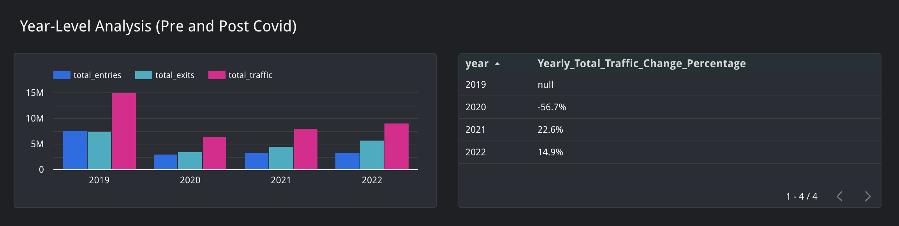
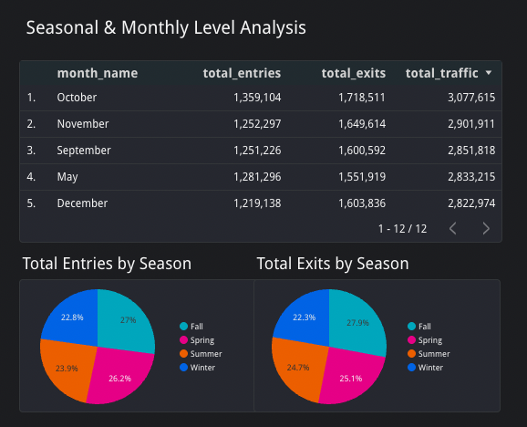

# Data-driven Actionable Business Insights

## Insights #1: 77th Street Station is steadily recovering from COVID

### What the data shows
1. In 2020, COVID has negatively impacted the station and resulted in ~57% in total traffic.
2. Post-COVID, the station has been steadily recovering and showed ~23% and ~15% annual increase in total traffic in 2021 and 2022, respectively.
3. The exit vs entry ratio has increased in 2021 and 2022, implying 77th Street has become more of a departure hub, with passengers exiting here to reach final destinations (later findings support this trend)

### ℹ️ Strategic Recommendation
1. Capitalize on Market Recovery Momentum:
  + Invest now during growth phase. 77th Street shows 23% and 15% annual traffic increases, indicating expanding audience reach
  + Secure long-term contracts at current rates before MTA adjusts pricing to reflect recovery success
2. Focus advertising content on departure-oriented messaging since 77th Street has become an exit hub. Targeting commuters transitioning to leisure activities such as dining, entertainment, shopping, and home-bound services.

### 💡 Implementation Example

* For dating brands like Bumble, the message could pertain to "Your workday is done - time for that dinner date you've been planning. Discover great spots near you for tonight."

* For food delivery brands like Uber Eats, the message could pertain to "Skip the cooking after a long day - your favorite dinner is just a tap away before you get home."

* For legal services brands like personal injury firms, the message could pertain to "Get home safe. If the unexpected happens on your commute, we're here to protect you."

* For retail brands like Target, the message could pertain to "One quick stop on your way home - grab what you need for tonight's dinner or tomorrow's meeting."

* For fitness brands like Equinox, the message could pertain to "End your workday with energy, not exhaustion. Your evening workout awaits just around the corner."

## Insights #2: Seasonal Consistency Demonstrates Advertiser-Friendly Stability

  
  
<em>Seasonal Analysis (COVID Year 2020 Excluded)</em>

### What the Data Shows
1. Winter appears to outperform other seasons (29% entries, 27% exits), but this is primarily driven by COVID-year anomalies in 2020 data.
2. When normalized for COVID impact, 77th Street demonstrates remarkable seasonal consistency across all periods, with Fall and Spring moderately outperformed others.
3. Seasonal distribution remains balanced (23-29% range) rather than showing extreme seasonal volatility typical of tourist or weather-dependent stations.
4. The entry/exit ratio stays consistent across seasons, indicating stable commuter patterns year-round.
5. Monthly analysis excluding 2020 COVID data reveals October and November as peak months, with September, May, and December maintaining strong consistent performance.

### ℹ️ Strategic Recommendation
1. Leverage Seasonal Stability to Secure Annual Contracts:
  + Invest in 77th Street for consistent audience delivery regardless of season
  + Lock in annual contracts to guarantee stable impression delivery across all campaign periods with confidence
2. Optimize Peak Month Campaigns:
  + Focus major campaign launches in October and November (highest traffic months excluding COVID year)

### 💡 Implementation Example
* For fitness brands like SoulCycle, this means instead of fighting competitors for crowded New Year's resolution advertising space, they should capture fitness-minded commuters months earlier during stable high-traffic periods like October and November, before January comes.

## Insights #3: Rush Hour Patterns Confirm Residential Commuter Destination

### What the data shows
1. 2019 Pre-COVID: Friday 5 PM dominated with 3.03 rush hour ratio, followed by Thursday and Wednesday 5 PM (2.96, 2.95 ratios)
2. 2020 COVID Disruption: Completely altered patterns with Saturday 1 AM (2.88 ratio) and midday hours replacing traditional rush periods
3. 2021-2022 Recovery: Rush hour patterns returned to pre-pandemic levels, with 2022 showing Friday 5 PM at 3.07 ratio - exceeding 2019 baseline
4. Consistent Evening Focus: Across all non-COVID years, 5 PM (hour 17) dominates the top rush hour slots, confirming departure-heavy traffic flow

### ℹ️ Strategic Recommendation
1. Choose Evening-Optimized Content Strategy:
  + Design ad content that works best during 5 PM peak hours when 3x more people will see your message
  + Create "end-of-workday" messaging since most impressions happen during evening departure times
2. Secure Long-Term Placement During Recovery:
  + Lock in annual contracts now while 2022 performance exceeds pre-pandemic levels, with the confidence in sustained recovery
  + Use complete market recovery data to justify increased investment in this location over competitors
3. Target Predictable Professional Audience:
  + Design campaigns for consistent weekday commuters rather than unpredictable tourist markets
  + Create content for regular, high-income commuters with predictable spending patterns and consistent daily routines

### 💡 Implementation Example
* For food delivery brands like Grubhub, the message could pertain to "Long day at the office? Skip the cooking tonight - your favorite dinner is just a tap away before you get home."
* For financial services brands like Fidelity, the message could pertain to "Reflecting on your future during your commute home? Take the next step toward your financial goals."
* For entertainment brands like AMC Theatre, the message could pertain to "Your workday is done - make tonight special. Catch the 7 PM Guardians of the Galaxy vol.4 instead of heading straight home."
