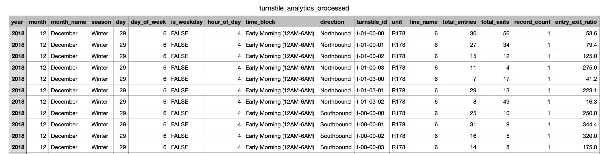

# 77th Street Turnstile Insights: Optimize Your Subway Ads

EXECUTIVE SUMMARY – Yunhao Dai

# Overview

I distilled four years of MTA counts into an interactive dashboard that surfaces rush-hour surges, post-COVID recovery, and gate-level entry/exit patterns—giving brands clear answers to when to buy, where to place, and what message to run at 77 th Street station.

Snapshot of the curated dataset for analytical work: 

# The Problem

- **What is the problem and how big is it?**

In 2025 the MTA is projected to earn about [\$175 million](https://www.amny.com/news/mta-nyc-subway-ads-and-money/) from advertising, yet brands buying subway‑turnstile wraps have almost no data to prove those dollars work. At 77 Street station, for example, over 6 million annual entries flow through just 15 turnstiles, but advertisers receive a single, station‑level rider count. They have no visibility into which gates handle the most traffic, when volume peaks, or whether commuters notice the creative. This gap in turnstile‑level insight leads to misallocated budgets, limited accountability, and messaging that often goes unseen.

- **Who is this problem affecting?**

This affects brand marketers, media buyers, and local advertisers who want to reach NYC commuters more effectively—especially in high-value neighborhoods like the Upper East Side. Without precise foot-traffic patterns, these stakeholders miss chances to maximize impact, target based on commuter behavior, or justify ROI to clients and leadership.

- **Are there current solutions or competitors?**

Some brands use station dominations, digital signage, or QR codes to boost engagement—but these tactics are broad, expensive, and rarely targeted. Most stations still display the **same creative across all turnstiles**, ignoring clear differences in foot traffic and direction. This misses a key opportunity: tailoring ads by gate volume or commuter mindset. **No current solution offers the turnstile-level insight needed for smarter, more strategic ad placement.**

# The Solution

This project bridges the targeting gap with a data-driven, turnstile-level analysis of 77th Street station. By transforming four years of MTA swipe data into clear insights: when traffic surges, which gates dominate, and how entry/exit flow varies. With these, brands are able to:

- Place smarter: Focus spend on high-traffic turnstiles with 3-4 times more impressions.
- Time better: Align content with rush hour patterns and post-COVID recovery trends.
- Message sharper: Match tone to commuter mindset based on arrival vs. departure, weekday vs. weekend, and their demographics.

# Highlights

These findings give brands a clear playbook for smarter ad planning at the station level:

- 3× More Visibility During Evening Rush

Weekday 5–8 PM traffic surges to 3× baseline, showing that 77th Street as a residential, homebound station.

- Turnstile-Level Insights, Not Just Station Totals

Identified specific gates with up to 4× higher foot traffic, enabling smarter ad placement and budget allocation.

- Real, Local Relevance

Neighborhood patterns show this is a commuter station for residents, not tourists, which is ideal for services, dining, and entertainment.
